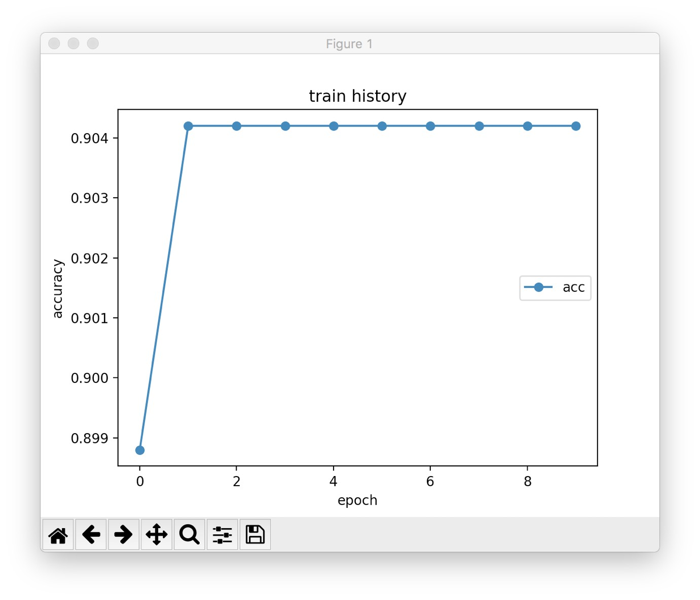

# LSTMによる素数判定

## 概要
　与えられた数が素数かどうかを一瞬で見分けることは人類にはできない. なぜならば, 素数の法則性が解明されていないがために演繹的に計算ができず, どうしても総当り戦法を取らなければならないからだ. だが, それでは現在のコンピュータでは現実的に計算可能ではない. たとえば有名なエラトステネスのふるいの計算量は`O(nloglogn)`となってしまう.(多分めっちゃ時間かかる)  

　そこで, 自然数を文字列の並びとみなし, その並び方から"なんとなく素数っぽい"という特徴量を掴ませることはできないかと考えた. 例えば, 一番右の文字が0, 4, 6, 8だった場合, 必ず素数ではない. また, 各桁総和が3だった場合は素数ではない. などなど数字の並びで素数ではない判定をできる. 

## 手法
　データセットだが, numpyを使って素数のリストを返してくれる関数がネットに転がっていたのでそれを使う.

```python
def get_primes(N=100000):
    natural_number = np.arange(N) + 1.0
    natural_number[0] = np.nan
    for i in range(1, int(np.floor(N/2))):
        natural_number[(natural_number!=natural_number[i]) & (natural_number%natural_number[i]==0)] = np.nan
    prime_number = natural_number[~np.isnan(natural_number)]
    prime_number = prime_number.astype(int)
    return prime_number
```

これを用いて1~100000までの数字に素数であるか素数でないかのラベル付をしたディクショナリを作成. そのディクショナリをpickleという機能を用いて保存する. 保存したものが`data.pickle`だ. このpickleファイルは作成するのに時間がかかるオブジェクトを保存し, 次に使うときには呼び出すだけというpythonの超便利機能である. (どの言語にもあるやろうけど...)

## 流れ
絵を書くのはめんどくさすぎたので口で説明します.  

1. 1~100000までの数字からランダムに10000個の数字をとってくる.
2. これらをLSTMに流し, 素数かどうかをモデルに学習させる.
3. 学習できたモデルに先ほどとは異なる数字を10000個を流す.
4. モデルの性能を評価する.

## コード
```main.py
# -*- coding: utf-8 -*- #

# ---------- Import ---------- #
import pickle
import numpy as np
import matplotlib.pyplot as plt

from keras.models import Sequential
from keras.layers.core import Dense, Activation, RepeatVector
from keras.layers.recurrent import LSTM
from keras.layers.wrappers import TimeDistributed
from keras.optimizers import Adam
from keras.callbacks import EarlyStopping
from sklearn.model_selection import train_test_split
from sklearn.utils import shuffle
from sklearn.metrics import classification_report


np.random.seed(0)


# ---------- データの準備 ---------- #
TRAIN = 10000

with open('data.pickle', 'rb') as f:
	data = pickle.load(f)

x, y = data['x'], data['y']

train_x, test_x, train_y, test_y = train_test_split(x, y, train_size = TRAIN)

chars = '0123456789'
input_digits = 6
output_digits = 1

# ---------- モデルの設定 --------- #
n_in = len(chars)
n_hidden = 128
n_out = 2

model = Sequential()
model.add(LSTM(n_hidden, input_shape=(input_digits, n_in)))

model.add(RepeatVector(output_digits))
model.add(LSTM(n_hidden, return_sequences=True))
model.add(TimeDistributed(Dense(n_out)))
model.add(Activation('softmax'))
model.compile(loss='binary_crossentropy',
              optimizer=Adam(lr=0.001, beta_1=0.9, beta_2=0.999),
              metrics=['accuracy'])

'''
モデル学習
'''
epochs = 2
batch_size = 500


histosy = model.fit(train_x, train_y, batch_size=batch_size, epochs=epochs,validation_data=(test_x, test_y))

model.summary()

# 検証データからランダムに問題を選んで答え合わせ
# for i in range(10):
#     index = np.random.randint(0, TEST)
#     question = test_x[np.array([index])]
#     answer = test_y[np.array([index])]
#     prediction = model.predict_classes(question, verbose=0)

#     question = question.argmax(axis=-1)
#     answer = answer.argmax(axis=-1)

#     print('-' * 10)
#     print(question[0])
#     if answer[0][0] == 1:
#             print("素数である")
#     else:
#             print("素数でない")

# print('-' * 10)

Y_pred = model.predict(test_x)
# pred_result = [bool(test[np.argmax(pred)]) for pred, test in zip(Y_pred, test_y)]
# wrong_index = np.where(np.array(pred_result) == False)
# NSLICE = 10
# 
# wrong_X = test_x[wrong_index]
# 
# fig_wrong = plt.figure(figsize=(13, 2))
# fig_wrong.suptitle("Wrong predictions")
# for i in range(NSLICE):
#     ax = fig_wrong.add_subplot(1, NSLICE, i+1)
#     ax.imshow(wrong_X[i].reshape(28,28), cmap='gray') 
#     ax.set_title(np.argmax(Y_pred[wrong_index[0][i]]))


print(classification_report(y_pred=[np.argmax(i) for i in Y_pred], y_true=[np.argmax(i) for i in test_y]))
print(Y_pred)

with open("histosy.pickle", mode='wb') as f:
        pickle.dump(histosy.history, f)


```

## 結果
できたモデルの性能は`plot.py`で出力できるようにしている.  
accuracyのグラフが以下だ.


## 考察
accuracyは0.904. 一見大成功に見えるが全くそんなことない. モデルの評価の方法はaccuracyだけではない. recallやf値など様々な評価方法がある. それらについては[こちら](http://ibisforest.org/index.php?F%E5%80%A4)を参照していただきたい.  

そして, このモデルのrecallを求めたところ...

```
0: 1.000
1: 0.000
``**
となった.  
つまり, どんな数字が来ても「全部素数じゃない!!!」って言ってただけだった. そもそも素数ってそんなに多くないから9割以上の成績も出してしまっていただけだった.  

**大失敗(T T)**
